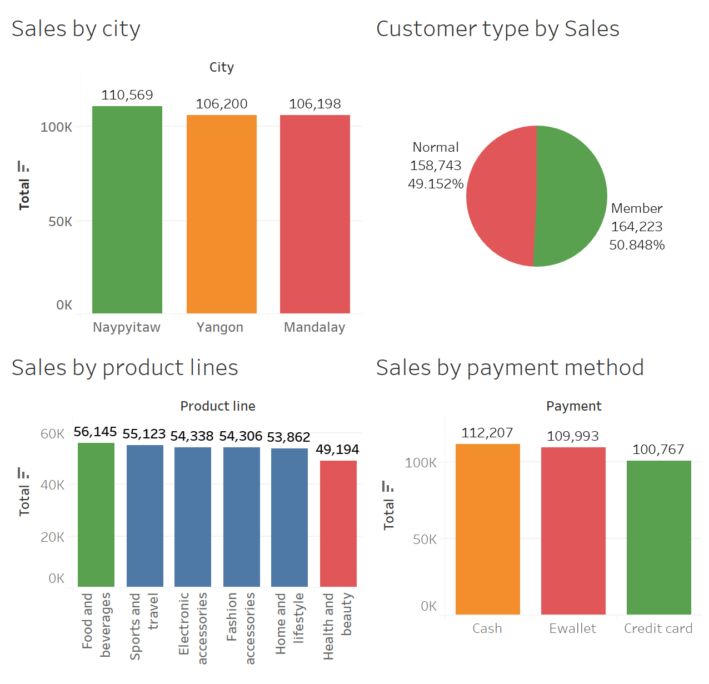
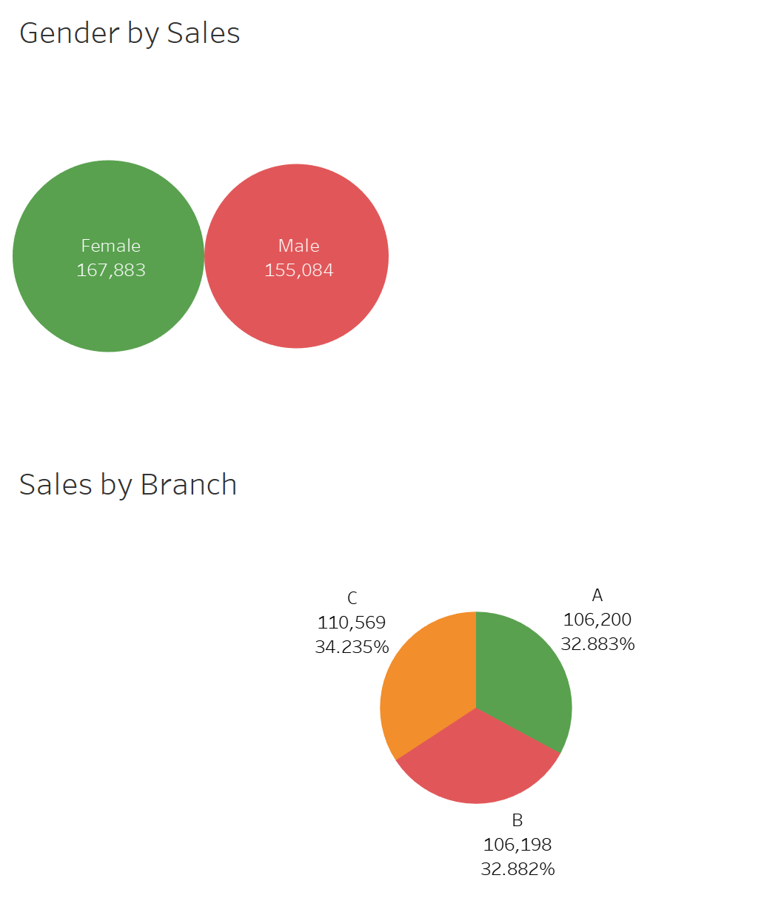
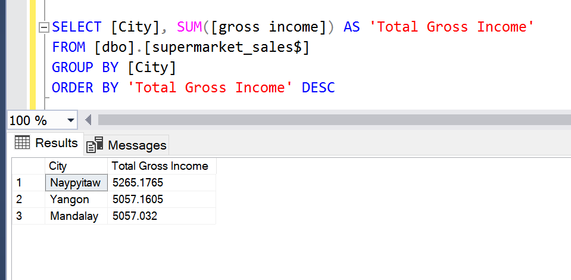
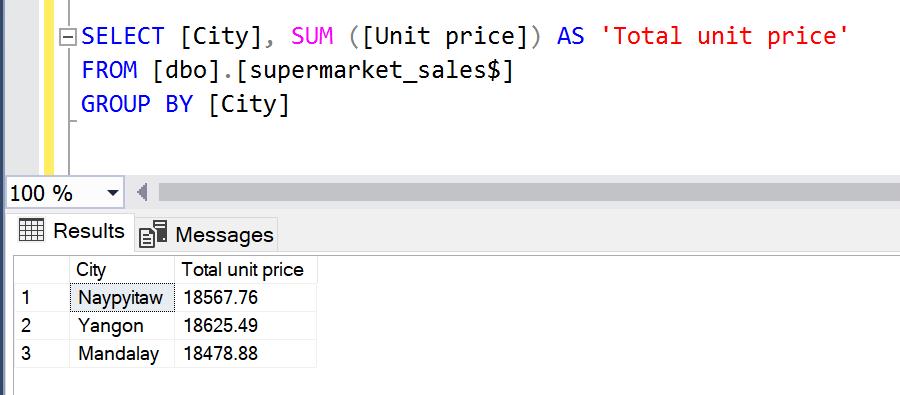
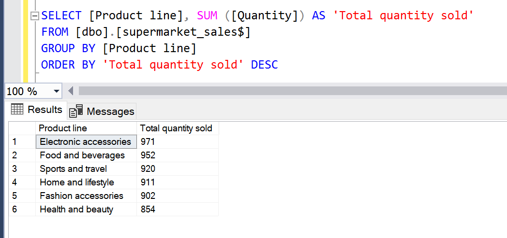
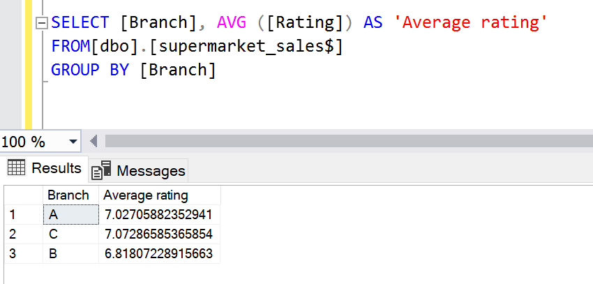

# Supermarket-Data-Analysis-Using-SQL-and-Tableau

This company operates a nationwide supermarket chain. Over the span of three months, the major branches situated in Mandalay, Naypyitaw, Yangon meticulously monitored sales. This project aims to aid the company in comprehending sales patterns more effectively and assessing its growth amidst intensifying competition in the supermarket industry.

visual1         |   visual2
:--------------:|:------------:
|

### The project stages and an overview of completed tasks.

The stages of the project include:

-	**Deciding the question** : How do sales data across branches and customer segments help us understand purchasing behaviors and factors influencing customer satisfaction? Through examination of product preferences, pricing strategies, and payment methods, what insights can we gain into revenue generation and profitability? Furthermore, how do seasonal trends, geographical variations, and membership status impact sales?

-	**Gathering the data** :This involved compiling sales records from three separate branches located in Mandalay, Naypyitaw, Yangon spanning a period of three months. The feature details within each branch's data file remained consistent throughout. They are: Invoice ID: Unique identification number for each transaction. Branch: Location of the supermarket branch (A for Yangon, B for Mandalay, C for Naypyitaw). City: Supermarket location. Customer type: Type of customers, recorded by Members for customers using member card and Normal for without member card. Gender: Customer gender. Product line: Categories of products such as Electronic accessories, Fashion accessories, Food and beverages, Health and beauty, Home and lifestyle, Sports and travel. Unit price: Price of each product in $. Quantity: Number of products purchased by customer. Tax: 5% tax fee for customer buying. Total: Total price including tax. Date: Date of purchase (Supermarket record available from January 2019 to March 2019). Time: Time of purchase (Supermarket hours 10 am to 9 pm). Payment: Payment used by customer for purchase (3 methods are available – Cash, Credit card and Epay). COGS: Cost of goods sold. Gross margin percentage: Gross margin percentage. Gross income: Gross income. Rating: Customer stratification rating on their overall shopping experience (On a scale of 1 to 10).

-	**Cleaning the data** Data Cleaning involves several steps to prepare data for analysis:

i. Ensuring Data Relevance by confirming that the provided datasets are pertinent for answering questions and conducting analysis.

ii. Maintaining Data Consistency by verifying that the supplied datasets exhibit consistency throughout.

iii. Exploring Data by identifying and addressing any duplicate or null values present in the datasets.

iv. Validating Data Accuracy by converting the date column to datetime format and ensuring accuracy in all other aspects of the data.

-	Upon completing the data cleaning process, the analysis phase commenced, which involved scrutinizing unique values within columns and performing aggregation using grouping techniques.

-	**Visualize and Sharing results** :After successfully analyzing the data, the results were visualized, which included determining the branch with the best sales record, identifying the most popular payment method and city with the highest sales, pinpointing the highest and lowest selling product lines, and assessing the predominant payment channel used for each product line.

### Insights

The analysis revealed that: 

i.	The city that generated the highest total gross income is Naypyitaw, amounting to #110568.7065, surpassing Mandalay's gross income by #4371.0345, which was the lowest among the cities studied.

ii.	The city that demonstrated the highest total unit price is Yangon at #18625.49, showcasing a difference of #146.61compared to Mandalay, which exhibits the lowest unit price.

iii.	The city with the highest total Quantity is Yangon, having a total Quantity of 1859, with a difference of 39 to the city with the lowest Quantity Mandalay.

iv.	The highest sold product line is Electronics accessories and the lowest sold product line is Health and beauty.

v.	Payment methods for each product line:

-	Most people use Epay for Health and beauty products.

-	Home and lifestyle products mostly use Epay.

-	Cash is popular for Sports and travel products.

-	People prefer Cash for Electronic accessories.

-	Card payments are common for Food and beverages.

-	Epay is popular for Fashion accessories.

vi.	The Payment channel for each branch:

- The Epay payment is most used in Yangon. 

- The Cash payment is most used in Naypyitaw. 

- The Epay payment is most used in Mandalay.

vii.	Branches 'A' (Yangon) and 'C' (Naypyitaw) have 50% of their ratings above 7 while branch 'B' (Mandalay) has 50% of it's ratings below. Hence branch 'B' has the lowest ratings.

viii.	The gender type effect on kind of products being purchased at the supermarket.

1. **Food and beverages** : 
59% of females bought more quantities of food and beverages compared to 40% of males. Among females, 59% spent over #31,591 on food and beverages, while among males, 40% spent over #21,879. This indicates that females have higher purchasing power—they buy more quantities and spend more on food and beverages compared to males. 

2.	**Fashion accessories** : 
56% of females bought more fashion accessories compared to 43% of males. Among females, 56% spent over #28,988 on fashion accessories, while among males, 43% spent #22,731. This indicates that females have higher purchasing power—they buy more fashion accessories and spend more compared to males.

3.	**Electronic accessories** : 
Around 50% of females bought roughly the same amount of electronic accessories as the top 50% of males. Among females, this 50% spent approximately #25,811 on electronic accessories, while the top 50% of males spent over #25,938. This suggests that both females and males have nearly equal purchasing power—they buy similar quantities and spend similar amounts on electronic accessories, though males spend slightly more.

4.	**Sport and travel** :
 Females exhibit approximately 52% more purchases in sport and travel compared to the top 48% of males. Among the top 52% of females, spending surpasses #27,214 on sport and travel, while the top 48% of males spend #25,283. This highlights that female possess greater purchasing power—they purchase more quantities and spend more on sport and travel compared to males.

5.	**Home and lifestyle** : Around 56% of females show greater interest in home and lifestyle compared to 44% of males. Among females, this 56% spends over #28,606 on home and lifestyle, while among males, the 44% spend #22,690. This underscores that females have stronger purchasing power—they buy more quantities and spend more on home and lifestyle compared to males.
   
6.	**Health and beauty** : About 37% of females bought fewer health and beauty products compared to 62% of males. Among females, this 37% spent over #17,677 on health and beauty, while among males, the 62% spent over #29,174. This clearly indicates that males have greater purchasing power—they purchase more quantities and spend more on health and beauty compared to females.
   
7.	The relationship between unit price and quantity of goods purchased follows this pattern: Electronic accessories have the lowest mean price, followed by Health and beauty, Home and lifestyle, Food and beverages, Sports and travel, and Fashion accessories. Conversely, the mean quantity of products purchased increases in the following order: Fashion accessories, Food and beverages, Sports and travel, Health and beauty, Home and lifestyle, and Electronic accessories. This suggests that Electronic accessories have the lowest mean price but the highest mean quantity purchased by customers, while Fashion accessories have the highest mean price but the lowest mean quantity purchased.

   
## Summary

-	Among the three locations nationwide, the Mandalay branch reported the lowest gross income, unit price, and number of items purchased by customers. This may stem from inadequate customer service at the branch. Consequently, the Mandalay branch received the lowest rating compared to the other two branches. Therefore, there is a need for heightened attention to this branch to enhance customer satisfaction, ultimately leading to increased gross revenue and the number of items purchased by customers.

-	Moreover, Epay transactions are most frequently reported in Yangon, Mandalay sees a high usage of Epay payments, while Naypyitaw records more cash payments. Therefore, ensuring the availability of these payment methods at their respective branches is crucial, as they are perceived as preferred options.

-	Furthermore, in contrast to male consumers, female customers exhibit stronger purchasing power, both in terms of spending and acquiring larger quantities of products, particularly in the fashion accessories, food and beverage, and sports and travel product lines. Conversely, male clients tend to spend more and purchase in greater quantities in the electronics accessories, health and beauty, and home and lifestyle product lines.

-	In conclusion, implementing changes informed by this information will enable the company to enhance its customer service and thrive, even amidst growing competition in the super

